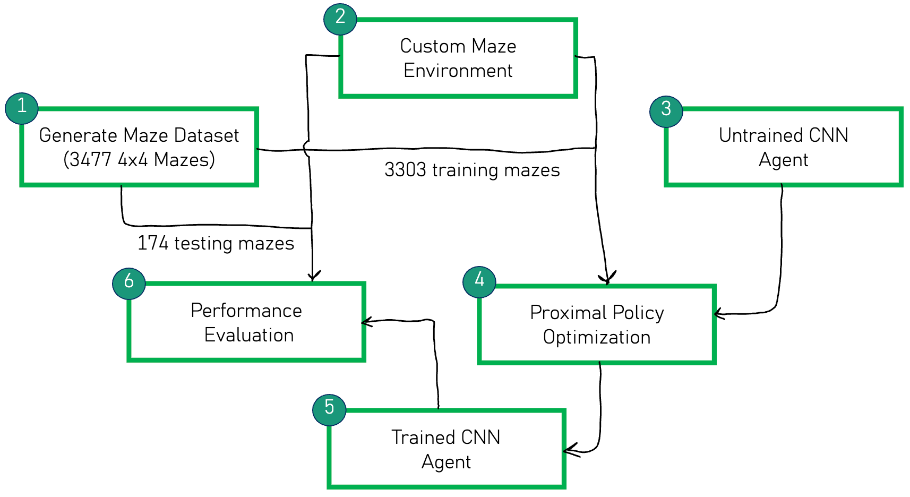
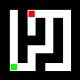
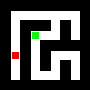
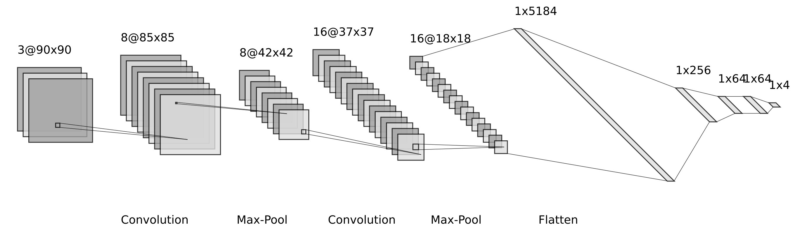
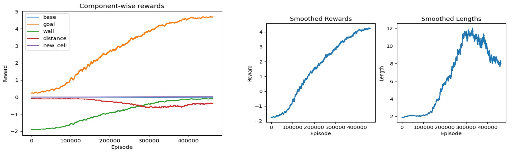
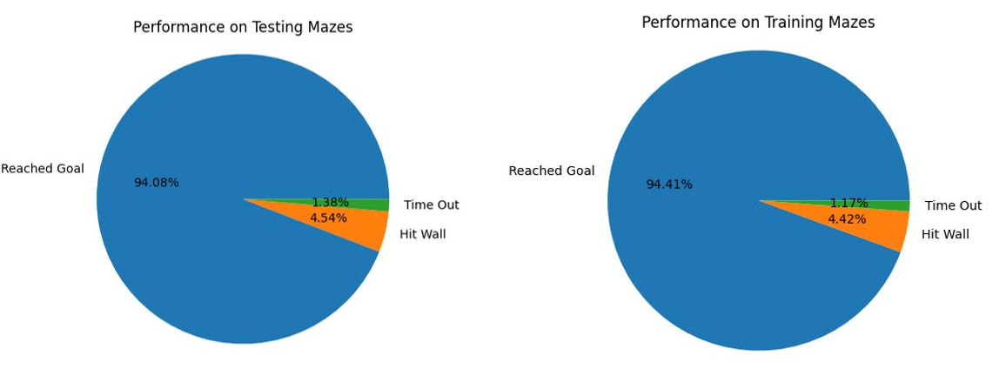
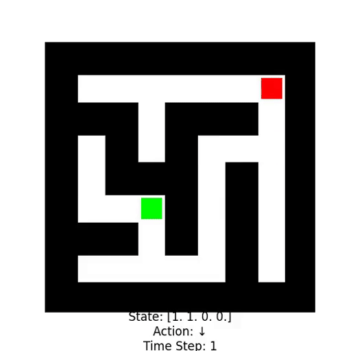

# MazeSolver

MazeSolver is a project that trains a Deep Reinforcement Learning (DRL) agent to navigate and solve mazes using only visual input (images of the maze). The agent learns to interpret the environment by detecting walls, locating the goal, and planning efficient paths without relying on handcrafted features or explicit maze-solving algorithms.

## Key Features

- ✅ Random and unique maze generation
- ✅ Custom maze environment with an OpenAI Gymnasium compatible API
- ✅ CNN-based PPO agent trained from scratch to extract meaningful features from the image and navigate itself to the goal
- ✅ Generalization across unseen mazes, allowing evaluation on new maze layouts without retraining

## Project Structure
```
MazeSolver/
├── assets/        # Images, GIFs, videos showcasing results
├── src/           # Core environment and agent implementations
├── README.md 
├── LICENSE 
```

## Overview 


Overall project flow:
  1. Start by generating unique mazes of desired size (4x4 for this project)
  2. Create the custom Gymansium-like environment for the DRL agent to operate on
  3. Start with an untrained Convolutional Neural Network (CNN) agent
  4. Train the CNN agent via Proximal Policy Optimization (PPO) 
  5. Evaluate on unseen testing mazes to test for generalization

## MazeEnv
   

MazeEnv is the custom maze environment created for this project. The above images are what is given to the agent as the state. Green square is the goal and red square is the agent.

The main characteristics are :
  1. Discrete actions (Move north, east, west or south)
  2. Detailed rewards (base, new cell, wall, goal, distance) for better reward function design
  3. Impact with a wall results in death (Can be toggled)
  4. Randomized mazes to ensure generalizability
  5. Randomized starting positions for both goal and agent also to ensure generalizability
  6. Optional telemetry information along with the image (Provides information regarding the presence of a wall in all four directions)

## CNN Agent

 


## Training


**Reward function**:
```
base:     -0.001,  # base penalty given every timestep to encourage faster episodes
goal:     +5.000,  # very large reward given for reaching the goal
wall:     -2.000,  # large penalty given for colliding with a wall 
new_cell: +0.005,  # small reward given for exploring unvisited cells in a particular episode
distance: -0.010   # penalty given every timestep scaled by the distance between the agent and goal
```

**Training curve**:

 

The agent was trained for 3 million timesteps with PPO across 12 parallel environments with stable_baselines3.

The following can be inferred from the training curve:

  - For the the first three quarters, the agent learns to survive for as long as possible
  - This is evident from how the wall penalty decreases in magnitude and the distance penalty increases(since its applied for longer) as well as the episode length curve
  - Once it learns to survive, it focuses on being able to reach the goal as efficiently as possible
  - This is evident from the decrease in distance penalty (as its ending the episode quicker) and increase in goal reward
    
## Results

**Performance Report**:

 

**Agent Solving Mazes**:



*NOTE: Some clips end before the agent reaches the goal. This happens when the agent collides with the wall and dies.*
